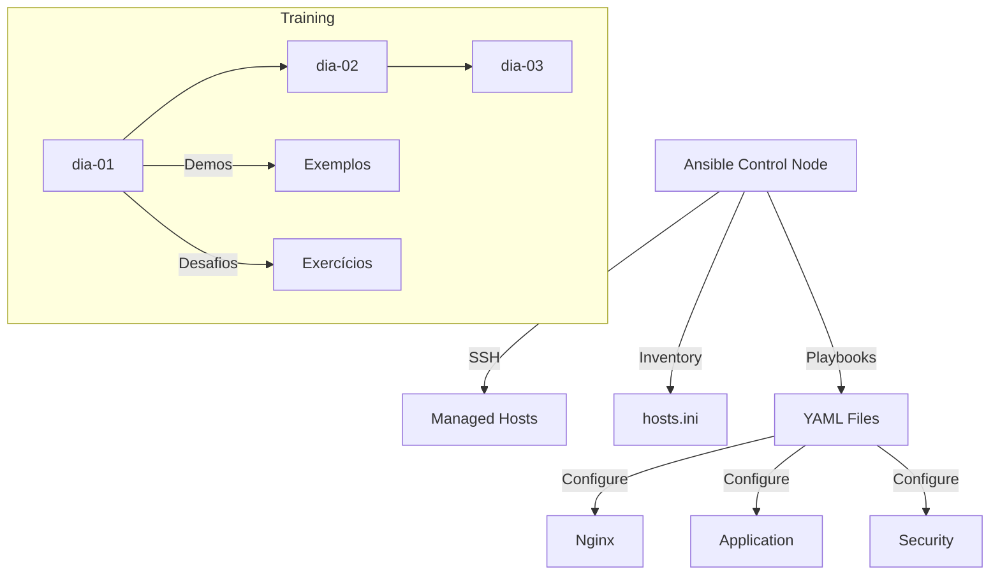

# Ansible DevSecOps CISSA

## 🌐🇧🇷 Versão em Português
## 🌐🇺🇸 [English Version](README_EN.md)

Repositório de materiais de treinamento para automação de infraestrutura usando Ansible, focado em práticas DevSecOps.

## 🔨 Funcionalidades do Projeto

- **Playbooks Ansible**: Automação de configuração de servidores
- **Materiais por Dia**: Organização modular de conteúdo por dias de treinamento
- **Demos**: Exemplos práticos de automação
- **Desafios**: Exercícios para fixação do conteúdo
- **Inventário**: Arquivo hosts.ini configurável

### 📸 Exemplos Visuais

<div align="center">
  
  
</div>

## ✔️ Técnicas e Tecnologias Utilizadas

- **Ansible**: Automação de TI e Configuration Management
- **YAML**: Linguagem para definição de playbooks
- **SSH**: Comunicação com servidores remotos
- **DevSecOps**: Práticas de segurança em desenvolvimento
- **CISSA**: Certified Information Systems Security Analyst

## 📊 Diagrama Mermaid



## 📁 Estrutura do Projeto

```
ansible-devsecops-cissa/
├── materiais/
│   ├── dia-01/          # Primeiros passos com Ansible
│   ├── dia-02/          # Configuração de serviços
│   ├── dia-03/          # Configuração de aplicações
│   ├── ansible.txt      # Referências Ansible
│   ├── hosts.ini        # Inventário de hosts
│   └── links.txt        # Links úteis
├── .serena/             # Configuração Serena AI
└── ARCHITECTURE.md      # Documentação de arquitetura
```

### Detalhes dos Diretórios

- **materiais/dia-\*/demos/**: Playbooks de exemplo para cada dia
- **materiais/dia-\*/desafios/**: Exercícios práticos
- **hosts.ini**: Arquivo de inventário configurável

## 🛠️ Abrir e Rodar o Projeto

### Pré-requisitos

1. **Instalar Ansible**:
   ```bash
   # Ubuntu/Debian
   sudo apt update
   sudo apt install ansible

   # macOS
   brew install ansible

   # Windows (via WSL ou pip)
   pip install ansible
   ```

2. **Verificar instalação**:
   ```bash
   ansible --version
   ```

### Executando um Playbook

1. **Clonar o repositório**:
   ```bash
   git clone <URL_DO_REPOSITORIO>
   cd ansible-devsecops-cissa
   ```

2. **Executar playbook de exemplo**:
   ```bash
   ansible-playbook -i materiais/hosts.ini materiais/dia-02/demos/setup_nginx.yml
   ```

3. **Verificar sintaxe**:
   ```bash
   ansible-playbook --syntax-check <playbook.yml>
   ```

## 🌐 Deploy

Para fazer deploy em servidores:

1. Configure o arquivo `hosts.ini` com seus servidores
2. Execute os playbooks Ansible:
   ```bash
   ansible-playbook -i materiais/hosts.ini <playbook.yml>
   ```

---

**Última atualização**: 2026-03-30
**Versão do projeto**: 1.0.0
**Manutenedor**: Felipe Moreira
