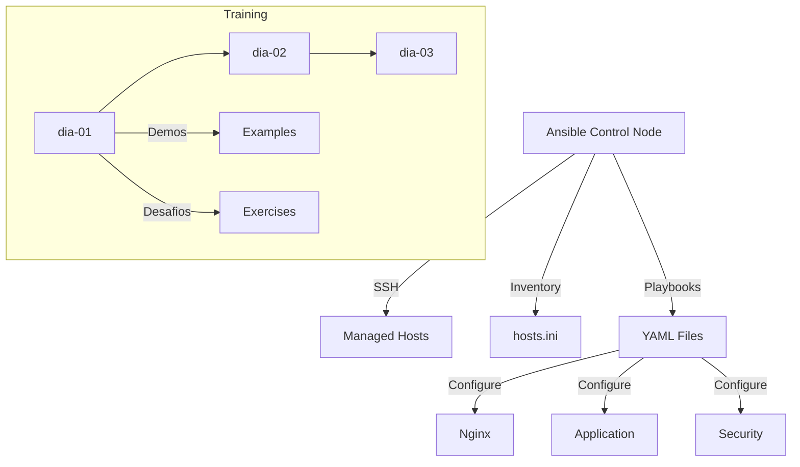

# Ansible DevSecOps CISSA

## 🌐🇧🇷 [Portuguese Version](README.md)
## 🌐🇺🇸 English Version

Training materials repository for infrastructure automation using Ansible, focused on DevSecOps practices.

## 🔨 Project Features

- **Ansible Playbooks**: Server configuration automation
- **Daily Materials**: Modular content organization by training days
- **Demos**: Practical automation examples
- **Challenges**: Exercises for content reinforcement
- **Inventory**: Configurable hosts.ini file

### 📸 Project Examples

<div align="center">
  
  
</div>

## ✔️ Techniques and Technologies Used

- **Ansible**: IT Automation and Configuration Management
- **YAML**: Playbook definition language
- **SSH**: Remote server communication
- **DevSecOps**: Security practices in development
- **CISSA**: Certified Information Systems Security Analyst

## 📊 Mermaid Diagram



## 📁 Project Structure

```
ansible-devsecops-cissa/
├── materiais/
│   ├── dia-01/          # Getting Started with Ansible
│   ├── dia-02/          # Service Configuration
│   ├── dia-03/          # Application Configuration
│   ├── ansible.txt      # Ansible References
│   ├── hosts.ini        # Hosts inventory
│   └── links.txt        # Useful links
├── .serena/             # Serena AI configuration
└── ARCHITECTURE.md      # Architecture documentation
```

### Directory Details

- **materiais/dia-\*/demos/**: Example playbooks for each day
- **materiais/dia-\*/desafios/**: Practical exercises
- **hosts.ini**: Configurable inventory file

## 🛠️ Open and Run the Project

### Prerequisites

1. **Install Ansible**:
   ```bash
   # Ubuntu/Debian
   sudo apt update
   sudo apt install ansible

   # macOS
   brew install ansible

   # Windows (via WSL or pip)
   pip install ansible
   ```

2. **Verify installation**:
   ```bash
   ansible --version
   ```

### Running a Playbook

1. **Clone the repository**:
   ```bash
   git clone <REPOSITORY_URL>
   cd ansible-devsecops-cissa
   ```

2. **Run example playbook**:
   ```bash
   ansible-playbook -i materiais/hosts.ini materiais/dia-02/demos/setup_nginx.yml
   ```

3. **Check syntax**:
   ```bash
   ansible-playbook --syntax-check <playbook.yml>
   ```

## 🌐 Deploy

To deploy to servers:

1. Configure the `hosts.ini` file with your servers
2. Run Ansible playbooks:
   ```bash
   ansible-playbook -i materiais/hosts.ini <playbook.yml>
   ```

---

**Last update**: 2026-03-30
**Project Version**: 1.0.0
**Maintainer**: Felipe Moreira
